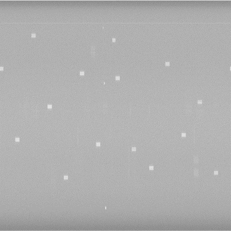
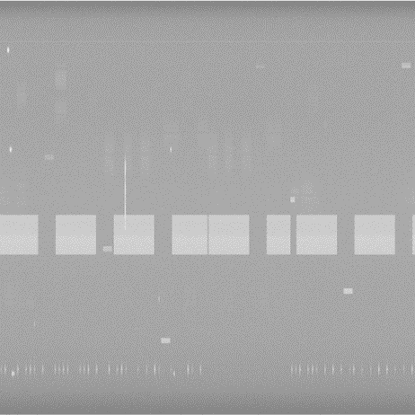
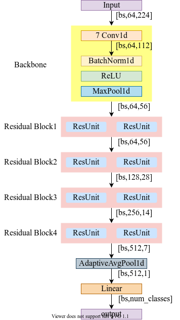
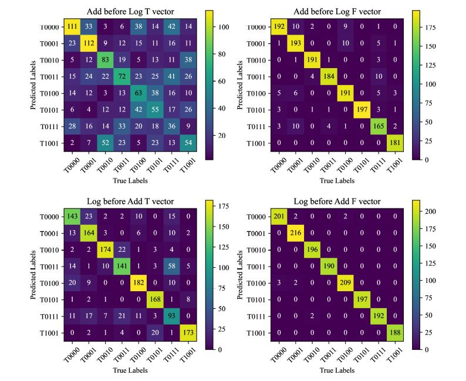
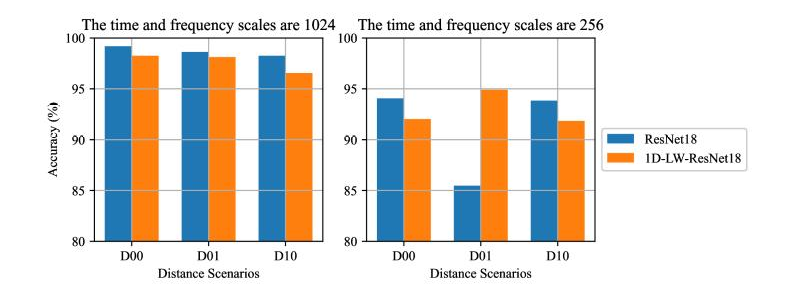

# 1D-LW-ResNet: High-Efficiency UAV Detector Based on RF Signals

## Introduction

1d_lw_ResNet is a simplified version of the ResNet network for the task of classifying and identifying RF signals from UAVs. Our work found that the feature distribution obtained along the frequency dimension in the spectrogram is more sparse, so we used a one-dimensional frequency vector as the input to the network, and changed ResNet to a one-dimensional network as well, which greatly reduces the number of parameters, and with the original Compared with the original method, this project guarantees the same accuracy and greatly reduces the number of parameters.

## Requirements

1. Install `pytorch` and `torchvision` (we use `pytorch>=1.13.0` and `torchvision>=0.14.0`).
2. `pip install -r requirements.txt`

## Run
### Download Processed Data

We used dataset form [DroneRFa](https://jeit.ac.cn/web/data/getData?dataType=Dataset3).

```
Benchmark
├── Data
    ├── D00 / D01 / D10
    │   ├── T0000
    │   ├── T0001
    │   ├── T0010
    │   ├── T0011
    │   ├── T0100
    │   ├── T0101
    │   ├── T0111
    │   ├── T1001
```

For these time-domain signal datasets, we use the STFT transform to convert them into spectrograms.

*Spectrogram of UAV Signal*

  

Converting spectrograms to frequency vectors. And we convert ResNet to 1d_lw_ResNet, as shown in Figure.

  

Confusion Matrix for the different order of operations and vectors.



Comparison of model accuracy for different distances, as well as different T and
N values.



## Project

```
project
├── test_1024: Spectrogram resolution is 1024, trained in ResNet18 and 1d_lw_ResNet18
├── test_STFT_npy: In order to test 'log' and 'sum' order of operations
├── test: Current test procedures
├── matlab: Some scrpit about matlab to process UAV time RF signal
```
